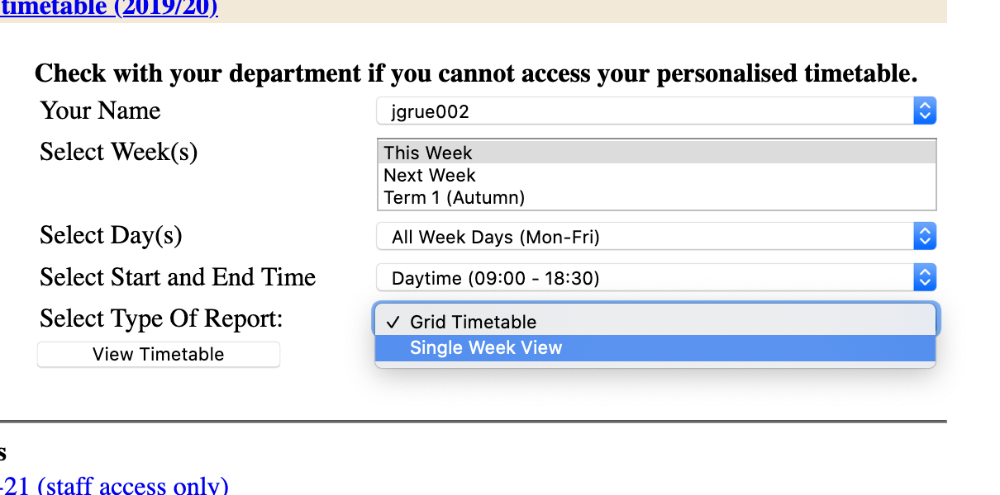

# Goldsmiths Timetable Export

(This software is not affiliated with or endorsed by the college)

Web Extension to export Goldsmiths Timetable to a format usable by all common calendar software.

## Usage

Navigate to any timetable and display it using 'Single Week View' (not the default 'Grid View').

When the extension is running, at the bottom of the single week view, an export button should appear.

After clicking the export button, the browser will load all available calendar weeks and then display a button to 
download the generated iCal (.ics) file.

iCal files can be imported into pretty much any calendar software or service (Google Calendar, Outlook etc.).

Keep in mind the export logic is pretty rough and may break at any point.

## Install

	$ npm install

## Development

    npm run dev chrome
    npm run dev firefox
    npm run dev opera
    npm run dev edge

## Build

    npm run build chrome
    npm run build firefox
    npm run build opera
    npm run build edge

## Docs
This extension is built with [webextension-toolbox](https://github.com/HaNdTriX/webextension-toolbox).
